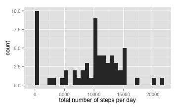
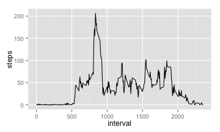
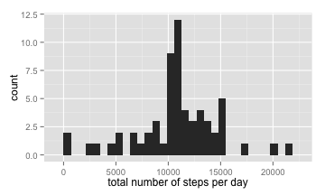
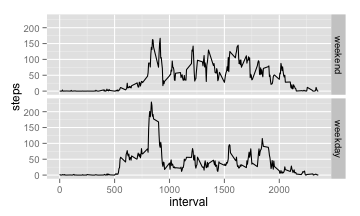

# Reproducible Research: Peer Assessment 1


## Loading and preprocessing the data
Here we load the raw data

```r
data <- read.csv("activity.csv")
```

Here is the summary of the data

```r
summary(data)
```

```
##      steps               date          interval   
##  Min.   :  0.0   2012-10-01:  288   Min.   :   0  
##  1st Qu.:  0.0   2012-10-02:  288   1st Qu.: 589  
##  Median :  0.0   2012-10-03:  288   Median :1178  
##  Mean   : 37.4   2012-10-04:  288   Mean   :1178  
##  3rd Qu.: 12.0   2012-10-05:  288   3rd Qu.:1766  
##  Max.   :806.0   2012-10-06:  288   Max.   :2355  
##  NA's   :2304    (Other)   :15840
```


## What is mean total number of steps taken per day?
In this part, we ignore the **NA** values.

We cauculate the total number of steps per day at first

```r
total_steps <- tapply(data$steps, data$date, FUN=sum, na.rm=TRUE)
```
Here is the histogram of the total number of steps taken each day

```r
library(ggplot2)
qplot(total_steps, xlab = "total number of steps per day")
```

```
## stat_bin: binwidth defaulted to range/30. Use 'binwidth = x' to adjust this.
```

 

The **mean** and **median** total number of steps taken per day is

```r
summary(total_steps)
```

```
##    Min. 1st Qu.  Median    Mean 3rd Qu.    Max. 
##       0    6780   10400    9350   12800   21200
```

## What is the average daily activity pattern?
In this part, we ignore the **NA** values.

Firstly we need to reshape the raw data to calculate the average number of steps taken per 5-minute interval, across all days. 

```r
library(reshape2)
data_melt <- melt(data, id="interval", measure.vars="steps", na.rm=TRUE)
ave_steps <- dcast(data_melt, interval ~ variable, mean)
summary(ave_steps)
```

```
##     interval        steps       
##  Min.   :   0   Min.   :  0.00  
##  1st Qu.: 589   1st Qu.:  2.49  
##  Median :1178   Median : 34.11  
##  Mean   :1178   Mean   : 37.38  
##  3rd Qu.:1766   3rd Qu.: 52.83  
##  Max.   :2355   Max.   :206.17
```

The time series plot of the 5-minute interval and the average number of steps taken is the following

```r
qplot(interval, steps, data = ave_steps, geom="line")
```

 

The 5-minute interval which has the maximum number of steps on average is 

```r
ave_steps[ave_steps$steps == max(ave_steps$steps), 'interval']
```

```
## [1] 835
```

## Imputing missing values
The total number of missing values is

```r
nrow(data) - sum(complete.cases(data))
```

```
## [1] 2304
```

Create a new dataset that is equal to the original dataset but with the missing data filled in, and the missing data is replaced with the mean for that 5-minute interval.

```r
data_rm_na <- data
for (i in 1:nrow(data_rm_na)) {
    if (is.na(data_rm_na[i,'steps'])) {
        curr_itv <- data_rm_na[i, 'interval']
        data_rm_na[i, 'steps'] <- ave_steps[which(ave_steps$interval == curr_itv), 'steps']
    }
}
summary(data_rm_na)
```

```
##      steps               date          interval   
##  Min.   :  0.0   2012-10-01:  288   Min.   :   0  
##  1st Qu.:  0.0   2012-10-02:  288   1st Qu.: 589  
##  Median :  0.0   2012-10-03:  288   Median :1178  
##  Mean   : 37.4   2012-10-04:  288   Mean   :1178  
##  3rd Qu.: 27.0   2012-10-05:  288   3rd Qu.:1766  
##  Max.   :806.0   2012-10-06:  288   Max.   :2355  
##                  (Other)   :15840
```

Make a histogram of the total number of steps taken each day

```r
total_steps_rm_na <- tapply(data_rm_na$steps, data_rm_na$date, FUN=sum)
qplot(total_steps_rm_na, xlab = "total number of steps per day")
```

```
## stat_bin: binwidth defaulted to range/30. Use 'binwidth = x' to adjust this.
```

 

from which we can see the histgram looks different, especially at the low range of *total number of steps per day*, where the counts of small "total number of steps per day" are decreased by filling in missing values.

The **mean** and **median** total number of steps taken per day is

```r
summary(total_steps_rm_na)
```

```
##    Min. 1st Qu.  Median    Mean 3rd Qu.    Max. 
##      41    9820   10800   10800   12800   21200
```

Compared with the original results which ignores **NA** data,

```r
summary(total_steps)
```

```
##    Min. 1st Qu.  Median    Mean 3rd Qu.    Max. 
##       0    6780   10400    9350   12800   21200
```
we again find that replacing **NA** data with the average value increases the mean and median of total number of steps taken per day, which is easy to understand since we have more data to add up in one day.


## Are there differences in activity patterns between weekdays and weekends?
In this part, we use the dataset with the filled-in missing values.

Convert the date to be Date object in R

```r
data_rm_na$date <- as.Date(data_rm_na$date)
```

Create a new factor variable in the dataset with two levels – “weekday” and “weekend”

```r
data_rm_na$weekday_type <- factor(weekdays(data_rm_na$date) != "Saturday" & weekdays(data_rm_na$date) != "Sunday")
levels(data_rm_na$weekday_type)[levels(data_rm_na$weekday_type)=="TRUE"] <- "weekday"
levels(data_rm_na$weekday_type)[levels(data_rm_na$weekday_type)=="FALSE"] <- "weekend"
```

Now let's re-calculate the averaged 5-minute interval steps

```r
data_melt_rm_na <- melt(data_rm_na, id=c("interval", "weekday_type"), measure.vars="steps")
ave_steps_rm_na <- dcast(data_melt_rm_na, interval+weekday_type ~ variable, mean)
summary(ave_steps_rm_na)
```

```
##     interval     weekday_type     steps       
##  Min.   :   0   weekend:288   Min.   :  0.00  
##  1st Qu.: 589   weekday:288   1st Qu.:  2.05  
##  Median :1178                 Median : 28.13  
##  Mean   :1178                 Mean   : 38.99  
##  3rd Qu.:1766                 3rd Qu.: 61.26  
##  Max.   :2355                 Max.   :230.38
```

The time series plots of the 5-minute interval and the average number of steps taken for weekdays and weekends are the following

```r
qplot(interval, steps, data = ave_steps_rm_na, geom="line", facets = weekday_type ~ .)
```

 

from which we can see there exists a pattern difference between weekdays and weekends. For example, in weekdays the subject becomes active earlier than in weekends, and s/he is more active in the morning and less active in the afternoon than in the weekends.


